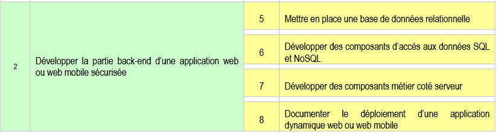

# Epreuve ECF n°2 - BLOC 2 - Bis

## Près-requis

- PHP en version 8.2
- Git
- Wamp / Mamp / Xampp
- MySql ou MariaDB

## Compétences visées

## Consignes

- Compléter le code existant sur chacune des pages afin que le site soit fonctionnel
- Identifier et corriger toutes les anomalies
- Sécuriser votre application contre les injections SQL et les failles XSS
- Compléter le fichier doc/DEPLOY.md en suivant les indications qui y figurent

**IMPORTANT : tâchez de faire un commit par correctif**

## Lancement de l'application

Utiliser le fichier bin/serve pour lancer le serveur de développement avec la commande suivante :

`php bin/serve`

OU utiliser WAMP/MAMP/XAMPP pour créer votre virtualhost

**ATTENTION : celui-ci doit pointer vers le dossier "public"**
